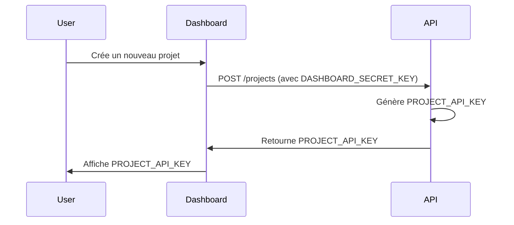
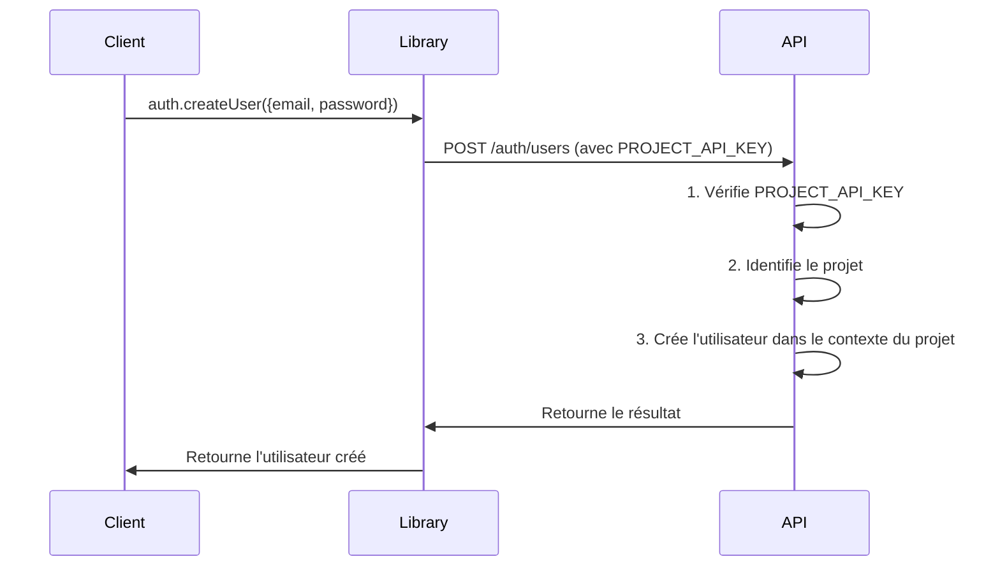

# Mini-Auth : Système d'Authentification Multi-Niveaux

## Vue d'ensemble

Mini-Auth est une API d'authentification qui fournit un système complet de gestion d'utilisateurs pour des projets multiples. Le système comprend :

1. Une API centrale
2. Un dashboard d'administration
3. Une librairie client pour les projets

## Architecture du Système

```
┌─────────────────┐         ┌─────────────────┐
│    Dashboard    │ ←──────→│      API        │
└─────────────────┘         └─────────────────┘
                                    ↑
┌─────────────────┐                │
│  App Client 1   │                │
│  (avec lib)     │────────────────┘
└─────────────────┘
        ⋮
┌─────────────────┐
│  App Client N   │                
│  (avec lib)     │────────────────┘
└─────────────────┘
```

## Composants du Système

### 1. API Centrale

#### Authentification
- Gestion de deux types de tokens :
  - `DASHBOARD_SECRET_KEY` : Pour l'accès dashboard
  - `PROJECT_API_KEY` : Pour l'accès projet (un par projet)

#### Middleware d'Authentification
```python
async def auth_middleware(request: Request, call_next):
    auth_header = request.headers.get("Authorization")
    if not auth_header:
        raise HTTPException(status_code=401)
        
    token = auth_header.split(" ")[1]
    
    # Vérification du type de token
    if token == settings.DASHBOARD_SECRET_KEY:
        request.state.auth_type = "dashboard"
        request.state.project_id = None
    else:
        project = await validate_project_api_key(token)
        if not project:
            raise HTTPException(status_code=401)
        request.state.auth_type = "project"
        request.state.project_id = project.id
    
    return await call_next(request)
```

### 2. Dashboard d'Administration

#### Fonctionnalités
- Création et gestion de projets
- Génération de `PROJECT_API_KEY`
- Monitoring des projets
- Configuration des projets

#### Authentification vers l'API
```typescript
// Exemple de requête dashboard
const response = await fetch(`${API_URL}/projects`, {
    headers: {
        'Authorization': `Bearer ${DASHBOARD_SECRET_KEY}`
    }
});
```

### 3. Librairie Client

#### Installation
```bash
npm install mini-auth-client
# ou
yarn add mini-auth-client
```

#### Utilisation
```typescript
import { MiniAuth } from 'mini-auth-client';

const auth = new MiniAuth({
    projectApiKey: 'PROJECT_API_KEY'
});

// Création d'un utilisateur
const user = await auth.createUser({
    email: 'user@example.com',
    password: 'secure_password'
});

// Connexion
const session = await auth.signIn({
    email: 'user@example.com',
    password: 'secure_password'
});
```

## Flux d'Utilisation

### 1. Création d'un Projet



### 2. Utilisation dans une Application Client



## Sécurité

### Isolation des Données
- Chaque projet est totalement isolé
- Les utilisateurs sont scopés à leur projet
- Impossible d'accéder aux données d'autres projets

### Protection des Routes
- Middleware d'authentification sur toutes les routes
- Validation du type de token (Dashboard vs Project)
- Vérification du scope projet pour chaque requête

### Stockage Sécurisé
- Hachage des mots de passe avec bcrypt
- Tokens JWT pour les sessions
- Clés API sécurisées et révocables

## Base de Données

### Structure Principale
```sql
-- Projets
CREATE TABLE projects (
    id UUID PRIMARY KEY,
    name VARCHAR(255),
    api_key VARCHAR(255),
    created_at TIMESTAMP
);

-- Utilisateurs de Projet
CREATE TABLE project_users (
    id UUID PRIMARY KEY,
    project_id UUID REFERENCES projects(id),
    email VARCHAR(255),
    password_hash VARCHAR(255),
    created_at TIMESTAMP
);
```

## API Endpoints

### Routes Dashboard
- `POST /projects` : Création d'un projet
- `GET /projects` : Liste des projets
- `GET /projects/:id` : Détails d'un projet
- `DELETE /projects/:id` : Suppression d'un projet

### Routes Projet (via librairie)
- `POST /auth/users` : Création d'utilisateur
- `POST /auth/login` : Connexion
- `POST /auth/logout` : Déconnexion
- `GET /auth/user` : Informations utilisateur
- `PUT /auth/user` : Mise à jour utilisateur 